``` r
library(maftools)
```

# Reading and summarizing maf files

## Reading MAF files

``` r
#path to TCGA LAML MAF file
laml.maf = system.file('extdata', 'tcga_laml.maf.gz', package = 'maftools') 
#clinical information containing survival information and histology. This is optional
laml.clin = system.file('extdata', 'tcga_laml_annot.tsv', package = 'maftools') 
# read.maf function reads MAF files, summarizes it in variuos ways and stores it as an MAF oject 
laml = read.maf(maf = laml.maf, clinicalData = laml.clin)
```

    ## -Reading
    ## -Validating
    ## -Silent variants: 475 
    ## -Summarizing
    ## -Processing clinical data
    ## -Finished in 0.989s elapsed (0.913s cpu)

## MAF object

Summarized MAF files is stored ans an MAF object. MAF object coaints
main maf file, summarized data and any associated sample annotations.

``` r
#Typing laml shows basic summary of MAF file.
laml
```

    ## An object of class  MAF 
    ##                    ID          summary  Mean Median
    ##  1:        NCBI_Build               37    NA     NA
    ##  2:            Center genome.wustl.edu    NA     NA
    ##  3:           Samples              193    NA     NA
    ##  4:            nGenes             1241    NA     NA
    ##  5:   Frame_Shift_Del               52 0.271      0
    ##  6:   Frame_Shift_Ins               91 0.474      0
    ##  7:      In_Frame_Del               10 0.052      0
    ##  8:      In_Frame_Ins               42 0.219      0
    ##  9: Missense_Mutation             1342 6.990      7
    ## 10: Nonsense_Mutation              103 0.536      0
    ## 11:       Splice_Site               92 0.479      0
    ## 12:             total             1732 9.021      9

``` r
#Shows sample summry.
getSampleSummary(laml)
```

    ##      Tumor_Sample_Barcode Frame_Shift_Del Frame_Shift_Ins In_Frame_Del
    ##   1:         TCGA-AB-3009               0               5            0
    ##   2:         TCGA-AB-2807               1               0            1
    ##   3:         TCGA-AB-2959               0               0            0
    ##   4:         TCGA-AB-3002               0               0            0
    ##   5:         TCGA-AB-2849               0               1            0
    ##  ---                                                                  
    ## 188:         TCGA-AB-2933               0               0            0
    ## 189:         TCGA-AB-2942               0               0            0
    ## 190:         TCGA-AB-2946               0               0            0
    ## 191:         TCGA-AB-2954               0               0            0
    ## 192:         TCGA-AB-2982               0               0            0
    ##      In_Frame_Ins Missense_Mutation Nonsense_Mutation Splice_Site total
    ##   1:            1                25                 2           1    34
    ##   2:            0                16                 3           4    25
    ##   3:            0                22                 0           1    23
    ##   4:            0                15                 1           5    21
    ##   5:            0                16                 1           2    20
    ##  ---                                                                   
    ## 188:            0                 1                 0           0     1
    ## 189:            1                 0                 0           0     1
    ## 190:            0                 1                 0           0     1
    ## 191:            0                 1                 0           0     1
    ## 192:            0                 1                 0           0     1

``` r
#Shows gene summary.
getGeneSummary(laml)
```

    ##       Hugo_Symbol Frame_Shift_Del Frame_Shift_Ins In_Frame_Del In_Frame_Ins
    ##    1:        FLT3               0               0            1           33
    ##    2:      DNMT3A               4               0            0            0
    ##    3:        NPM1               0              33            0            0
    ##    4:        IDH2               0               0            0            0
    ##    5:        IDH1               0               0            0            0
    ##   ---                                                                      
    ## 1237:      ZNF689               0               0            0            0
    ## 1238:      ZNF75D               0               0            0            0
    ## 1239:      ZNF827               1               0            0            0
    ## 1240:       ZNF99               0               0            0            0
    ## 1241:        ZPBP               0               0            0            0
    ##       Missense_Mutation Nonsense_Mutation Splice_Site total MutatedSamples
    ##    1:                15                 0           3    52             52
    ##    2:                39                 5           6    54             48
    ##    3:                 1                 0           0    34             33
    ##    4:                20                 0           0    20             20
    ##    5:                18                 0           0    18             18
    ##   ---                                                                     
    ## 1237:                 1                 0           0     1              1
    ## 1238:                 1                 0           0     1              1
    ## 1239:                 0                 0           0     1              1
    ## 1240:                 1                 0           0     1              1
    ## 1241:                 1                 0           0     1              1
    ##       AlteredSamples
    ##    1:             52
    ##    2:             48
    ##    3:             33
    ##    4:             20
    ##    5:             18
    ##   ---               
    ## 1237:              1
    ## 1238:              1
    ## 1239:              1
    ## 1240:              1
    ## 1241:              1

``` r
#shows clinical data associated with samples
getClinicalData(laml)
```

    ##      Tumor_Sample_Barcode FAB_classification days_to_last_followup
    ##   1:         TCGA-AB-2802                 M4                   365
    ##   2:         TCGA-AB-2803                 M3                   792
    ##   3:         TCGA-AB-2804                 M3                  2557
    ##   4:         TCGA-AB-2805                 M0                   577
    ##   5:         TCGA-AB-2806                 M1                   945
    ##  ---                                                              
    ## 189:         TCGA-AB-3007                 M3                  1581
    ## 190:         TCGA-AB-3008                 M1                   822
    ## 191:         TCGA-AB-3009                 M4                   577
    ## 192:         TCGA-AB-3011                 M1                  1885
    ## 193:         TCGA-AB-3012                 M3                  1887
    ##      Overall_Survival_Status
    ##   1:                       1
    ##   2:                       1
    ##   3:                       0
    ##   4:                       1
    ##   5:                       1
    ##  ---                        
    ## 189:                       0
    ## 190:                       1
    ## 191:                       1
    ## 192:                       0
    ## 193:                       0

``` r
#Shows all fields in MAF
getFields(laml)
```

    ##  [1] "Hugo_Symbol"            "Entrez_Gene_Id"         "Center"                
    ##  [4] "NCBI_Build"             "Chromosome"             "Start_Position"        
    ##  [7] "End_Position"           "Strand"                 "Variant_Classification"
    ## [10] "Variant_Type"           "Reference_Allele"       "Tumor_Seq_Allele1"     
    ## [13] "Tumor_Seq_Allele2"      "Tumor_Sample_Barcode"   "Protein_Change"        
    ## [16] "i_TumorVAF_WU"          "i_transcript_name"

``` r
#Writes maf summary to an output file with basename laml.
write.mafSummary(maf = laml, basename = 'laml')
```

# Visualization

## Plotting MAF summary.

We can use `plotmafSummary` to plot the summary of the maf file, which
displays number of variants in each sample as a stacked barplot and
variant types as a boxplot summarized by Variant\_Classification. We can
add either mean or median line to the stacked barplot to display
average/median number of variants across the
cohort.

``` r
plotmafSummary(maf = laml, rmOutlier = TRUE, addStat = 'median', dashboard = TRUE, titvRaw = FALSE)
```

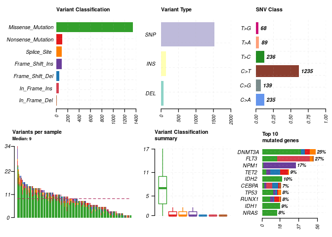<!-- -->

## Oncoplots

### Drawing oncoplots

Better representation of maf file can be shown as oncoplots, also known
as waterfall plots. Side barplot and top barplots can be controlled by
`drawRowBar` and `drawColBar` arguments respectively.

``` r
#oncoplot for top ten mutated genes.
oncoplot(maf = laml, top = 10)
```

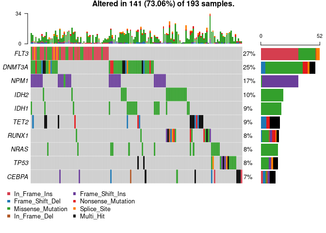<!-- --> \#\#
Oncostrip We can visualize any set of genes using `oncostrip` function,
which draws mutations in each sample similar to OncoPrinter tool on
cBioPortal. `oncostrip` can be used to draw any number of genes using
`top` or `genes` arguments.

``` r
oncostrip(maf = laml, genes = c('DNMT3A','NPM1', 'RUNX1'))
```

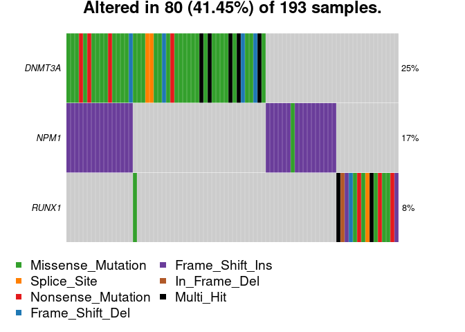<!-- --> \#\#
Transition and Transversions. titv function classifies SNPs into
Transitions and Transversions and returns a list of summarized tables in
various ways. Summarized data can also be visualized as a boxplot
showing overall distribution of six different conversions and as a
stacked barplot showing fraction of conversions in each sample.

``` r
laml.titv = titv(maf = laml, plot = FALSE, useSyn = TRUE)
#plot titv summary
plotTiTv(res = laml.titv)
```

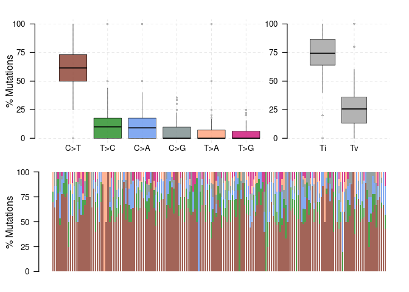<!-- --> \#\#
Lollipop plots for amino acid changes Lollipop plots are simple and most
effective way showing mutation spots on protein structure. Many
oncogenes have a preferential sites which are mutated more often than
any other locus. These spots are considered to be mutational hot-spots
and lollipop plots can be used to display them along with rest of the
mutations. We can draw such plots using the function `lollipopPlot`.
This function requires us to have amino acid changes information in the
maf file. However MAF files have no clear guidelines on naming the field
for amino acid changes, with different studies having different field
(or column) names for amino acid changes. By default, `lollipopPlot`
looks for column `AAChange`, and if its not found in the MAF file, it
prints all available fields with a warning message. For below example,
MAF file contains amino acid changes under a field/column name
‘Protein\_Change’. We will manually specify this using argument
`AACol`. This function also returns the plot as a ggplot object, which
user can later modify if
needed.

``` r
#lollipop plot for DNMT3A, which is one of the most frequent mutated gene in Leukemia.
lollipopPlot(maf = laml, gene = 'DNMT3A', AACol = 'Protein_Change', showMutationRate = TRUE)
```

    ## 3 transcripts available. Use arguments refSeqID or proteinID to manually specify tx name.

    ##      HGNC refseq.ID protein.ID aa.length
    ## 1: DNMT3A NM_175629  NP_783328       912
    ## 2: DNMT3A NM_022552  NP_072046       912
    ## 3: DNMT3A NM_153759  NP_715640       723

    ## Using longer transcript NM_175629 for now.

    ## Removed 3 mutations for which AA position was not available

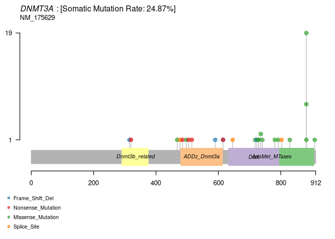<!-- -->

### Labelling points.

We can also label points on the `lollipopPlot` using argument
`labelPos`. If `labelPos` is set to ‘all’, all of the points are
highlighted.

``` r
lollipopPlot(maf = laml, gene = 'KIT', AACol = 'Protein_Change', labelPos = 816, refSeqID = 'NM_000222')
```

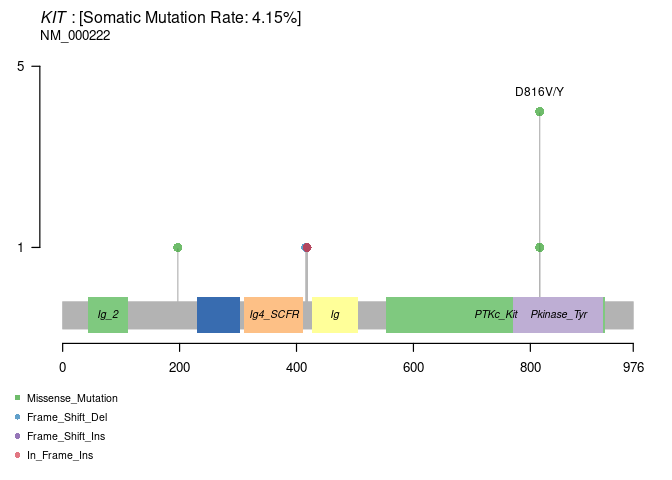<!-- --> \#\#
Rainfall plots Cancer genomes, especially solid tumors are characterized
by genomic loci with localized hyper-mutations 5. Such hyper mutated
genomic regions can be visualized by plotting inter variant distance on
a linear genomic scale. These plots generally called rainfall plots and
we can draw such plots using rainfallPlot. If detectChangePoints is set
to TRUE, rainfall plot also highlights regions where potential changes
in inter-event distances are located.

``` r
brca <- system.file("extdata", "brca.maf.gz", package = "maftools")
brca = read.maf(maf = brca, verbose = FALSE)
```

``` r
rainfallPlot(maf = brca, detectChangePoints = TRUE, pointSize = 0.6)
```

    ## Processing TCGA-A8-A08B..

    ## Kataegis detected at:

    ##    Chromosome Start_Position End_Position nMuts Avg_intermutation_dist Size
    ## 1:          8       98129348     98133560     7               702.0000 4212
    ## 2:          8       98398549     98403536     9               623.3750 4987
    ## 3:          8       98453076     98456466     9               423.7500 3390
    ## 4:          8      124090377    124096810    22               306.3333 6433
    ## 5:         12       97436055     97439705     7               608.3333 3650
    ## 6:         17       29332072     29336153     8               583.0000 4081
    ##    Tumor_Sample_Barcode C>G C>T
    ## 1:         TCGA-A8-A08B   4   3
    ## 2:         TCGA-A8-A08B   1   8
    ## 3:         TCGA-A8-A08B   1   8
    ## 4:         TCGA-A8-A08B   1  21
    ## 5:         TCGA-A8-A08B   4   3
    ## 6:         TCGA-A8-A08B   4   4

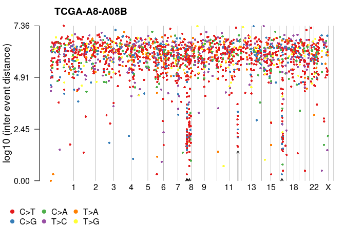<!-- --> \#\#
Compare mutation load against TCGA cohorts TCGA contains over 30
different cancer cohorts and median mutation load across them varies
from as low as 7 per exome (Pheochromocytoma and Paraganglioma arising
from Adrenal Gland) to as high as 315 per exome (Skin Cutaneoys
Melanoma). It is informative to see how mutation load in given maf
stands against TCGA cohorts. This can can be achieved with the function
tcgaComapre which draws distribution of variants compiled from over
10,000 WXS samples across 33 TCGA landmark cohorts. Plot generated is
similar to the one described in Alexandrov et al 5.

``` r
laml.mutload = tcgaCompare(maf = laml, cohortName = 'Example-LAML')
```

    ## Performing pairwise t-test for differences in mutation burden..

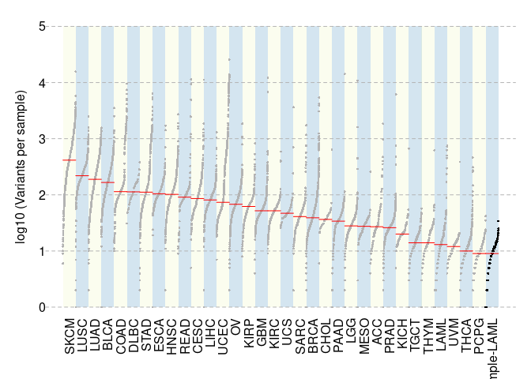<!-- --> \#\#
Plotting VAF This function plots Variant Allele Frequencies as a boxplot
which quickly helps to estimate clonal status of top mutated genes
(clonal genes usually have mean allele frequency around ~50% assuming
pure sample)

``` r
plotVaf(maf = laml, vafCol = 'i_TumorVAF_WU')
```

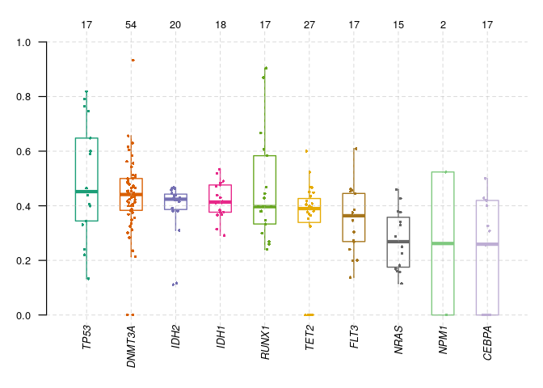<!-- --> \#\#
Genecloud We can plot word cloud plot for mutated genes with the
function geneCloud. Size of each gene is proportional to the total
number of samples in which it is mutated/altered.

``` r
geneCloud(input = laml, minMut = 3)
```

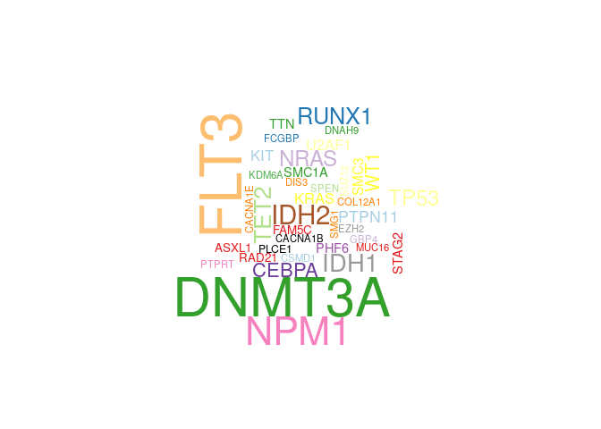<!-- --> \#
Processing copy-number data \#\# Reading and summarizing gistic output
files. We can summarize output files generated by GISTIC programme. As
mentioned earlier, we need four files that are generated by GISTIC, i.e,
all\_lesions.conf\_XX.txt, amp\_genes.conf\_XX.txt,
del\_genes.conf\_XX.txt and scores.gistic, where XX is the confidence
level.

``` r
all.lesions <- system.file("extdata", "all_lesions.conf_99.txt", package = "maftools")
amp.genes <- system.file("extdata", "amp_genes.conf_99.txt", package = "maftools")
del.genes <- system.file("extdata", "del_genes.conf_99.txt", package = "maftools")
scores.gis <- system.file("extdata", "scores.gistic", package = "maftools")
laml.gistic = readGistic(gisticAllLesionsFile = all.lesions, gisticAmpGenesFile = amp.genes, gisticDelGenesFile = del.genes, gisticScoresFile = scores.gis, isTCGA = TRUE)
```

    ## -Processing Gistic files..
    ## --Processing amp_genes.conf_99.txt
    ## --Processing del_genes.conf_99.txt
    ## --Processing scores.gistic
    ## --Summarizing by samples

``` r
#GISTIC object
laml.gistic
```

    ## An object of class  GISTIC 
    ##           ID summary
    ## 1:   Samples     191
    ## 2:    nGenes    2622
    ## 3: cytoBands      16
    ## 4:       Amp     388
    ## 5:       Del   26481
    ## 6:     total   26869

## Visualizing gistic results.

There are three types of plots available to visualize gistic results.
\#\#\# genome plot

``` r
gisticChromPlot(gistic = laml.gistic, markBands = "all")
```

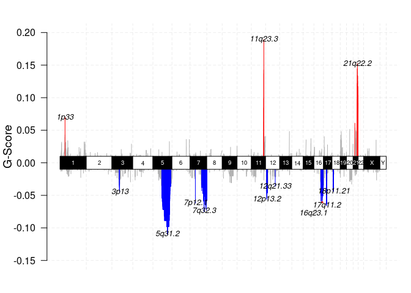<!-- -->
\#\#\# Bubble plot

``` r
gisticBubblePlot(gistic = laml.gistic)
```

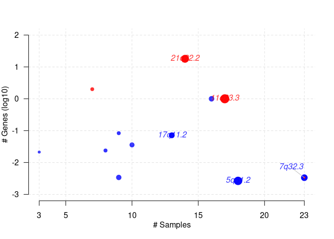<!-- -->
\#\#\# oncoplot This is similar to oncoplots except for copy number
data. One can again sort the matrix according to annotations, if any.
Below plot is the gistic results for LAML, sorted according to FAB
classification. Plot shows that 7q deletions are virtually absent in M4
subtype where as it is widespread in other
subtypes.

``` r
gisticOncoPlot(gistic = laml.gistic, clinicalData = getClinicalData(x = laml), clinicalFeatures = 'FAB_classification', sortByAnnotation = TRUE, top = 10)
```

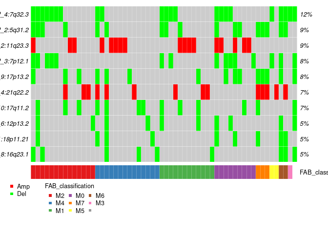<!-- -->
\#\#\# Visualizing CBS
segments

``` r
tcga.ab.009.seg <- system.file("extdata", "TCGA.AB.3009.hg19.seg.txt", package = "maftools")
plotCBSsegments(cbsFile = tcga.ab.009.seg)
```

    ## NULL

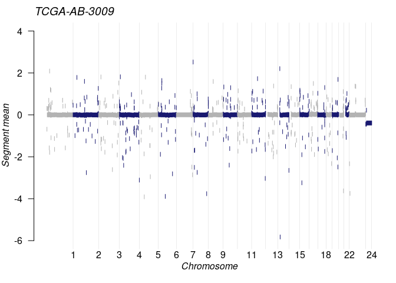<!-- --> \#
Analysis \#\# Somatic Interactions Many disease causing genes in cancer
are co-occurring or show strong exclusiveness in their mutation pattern.
Such mutually exclusive or co-occurring set of genes can be detected
using somaticInteractions function, which performs pair-wise Fisher’s
Exact test to detect such significant pair of genes. somaticInteractions
function also uses cometExactTest to identify potentially altered gene
sets involving \>2 two genes 6.

``` r
#exclusive/co-occurance event analysis on top 10 mutated genes. 
somaticInteractions(maf = laml, top = 25, pvalue = c(0.05, 0.1))
```

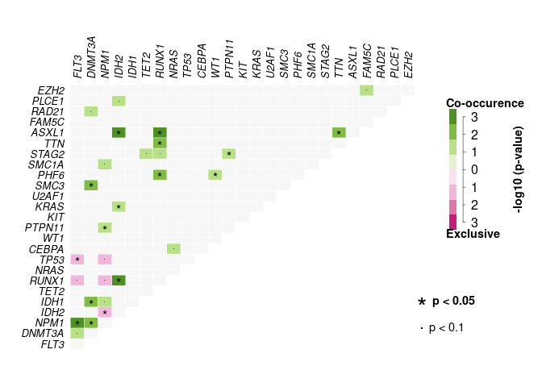<!-- -->

    ##      gene1  gene2       pValue oddsRatio  00 11 01 10              Event
    ##   1: ASXL1  RUNX1 0.0001541586 55.215541 176  4 12  1       Co_Occurence
    ##   2:  IDH2  RUNX1 0.0002809928  9.590877 164  7  9 13       Co_Occurence
    ##   3:  IDH2  ASXL1 0.0004030636 41.077327 172  4  1 16       Co_Occurence
    ##   4:  FLT3   NPM1 0.0009929836  3.763161 125 17 16 35       Co_Occurence
    ##   5:  SMC3 DNMT3A 0.0010451985 20.177713 144  6 42  1       Co_Occurence
    ##  ---                                                                    
    ## 296: PLCE1  ASXL1 1.0000000000  0.000000 184  0  5  4 Mutually_Exclusive
    ## 297: RAD21  FAM5C 1.0000000000  0.000000 183  0  5  5 Mutually_Exclusive
    ## 298: PLCE1  FAM5C 1.0000000000  0.000000 184  0  5  4 Mutually_Exclusive
    ## 299: PLCE1  RAD21 1.0000000000  0.000000 184  0  5  4 Mutually_Exclusive
    ## 300:  EZH2  PLCE1 1.0000000000  0.000000 186  0  4  3 Mutually_Exclusive
    ##              pair event_ratio
    ##   1: ASXL1, RUNX1        4/13
    ##   2:  IDH2, RUNX1        7/22
    ##   3:  ASXL1, IDH2        4/17
    ##   4:   FLT3, NPM1       17/51
    ##   5: DNMT3A, SMC3        6/43
    ##  ---                         
    ## 296: ASXL1, PLCE1         0/9
    ## 297: FAM5C, RAD21        0/10
    ## 298: FAM5C, PLCE1         0/9
    ## 299: PLCE1, RAD21         0/9
    ## 300:  EZH2, PLCE1         0/7

## Detecting cancer driver genes based on positional clustering

maftools has a function oncodrive which identifies cancer genes (driver)
from a given MAF. oncodrive is a based on algorithm oncodriveCLUST which
was originally implemented in Python. Concept is based on the fact that
most of the variants in cancer causing genes are enriched at few
specific loci (aka hot-spots). This method takes advantage of such
positions to identify cancer
genes.

``` r
laml.sig = oncodrive(maf = laml, AACol = 'Protein_Change', minMut = 5, pvalMethod = 'zscore')
```

    ## Warning in oncodrive(maf = laml, AACol = "Protein_Change", minMut = 5,
    ## pvalMethod = "zscore"): Oncodrive has been superseeded by OncodriveCLUSTL. See
    ## http://bg.upf.edu/group/projects/oncodrive-clust.php

    ## Estimating background scores from synonymous variants..

    ## Not enough genes to build background. Using predefined values. (Mean = 0.279; SD = 0.13)

    ## Estimating cluster scores from non-syn variants..

    ##   |                                                                              |                                                                      |   0%  |                                                                              |===                                                                   |   4%  |                                                                              |======                                                                |   9%  |                                                                              |=========                                                             |  13%  |                                                                              |============                                                          |  17%  |                                                                              |===============                                                       |  22%  |                                                                              |==================                                                    |  26%  |                                                                              |=====================                                                 |  30%  |                                                                              |========================                                              |  35%  |                                                                              |===========================                                           |  39%  |                                                                              |==============================                                        |  43%  |                                                                              |=================================                                     |  48%  |                                                                              |=====================================                                 |  52%  |                                                                              |========================================                              |  57%  |                                                                              |===========================================                           |  61%  |                                                                              |==============================================                        |  65%  |                                                                              |=================================================                     |  70%  |                                                                              |====================================================                  |  74%  |                                                                              |=======================================================               |  78%  |                                                                              |==========================================================            |  83%  |                                                                              |=============================================================         |  87%  |                                                                              |================================================================      |  91%  |                                                                              |===================================================================   |  96%  |                                                                              |======================================================================| 100%

    ## Comapring with background model and estimating p-values..

    ## Done !

``` r
head(laml.sig)
```

    ##    Hugo_Symbol Frame_Shift_Del Frame_Shift_Ins In_Frame_Del In_Frame_Ins
    ## 1:        IDH1               0               0            0            0
    ## 2:        IDH2               0               0            0            0
    ## 3:        NPM1               0              33            0            0
    ## 4:        NRAS               0               0            0            0
    ## 5:       U2AF1               0               0            0            0
    ## 6:         KIT               1               1            0            1
    ##    Missense_Mutation Nonsense_Mutation Splice_Site total MutatedSamples
    ## 1:                18                 0           0    18             18
    ## 2:                20                 0           0    20             20
    ## 3:                 1                 0           0    34             33
    ## 4:                15                 0           0    15             15
    ## 5:                 8                 0           0     8              8
    ## 6:                 7                 0           0    10              8
    ##    AlteredSamples clusters muts_in_clusters clusterScores protLen   zscore
    ## 1:             18        1               18     1.0000000     414 5.546154
    ## 2:             20        2               20     1.0000000     452 5.546154
    ## 3:             33        2               32     0.9411765     294 5.093665
    ## 4:             15        2               15     0.9218951     189 4.945347
    ## 5:              8        1                7     0.8750000     240 4.584615
    ## 6:              8        2                9     0.8500000     976 4.392308
    ##            pval          fdr fract_muts_in_clusters
    ## 1: 1.460110e-08 1.022077e-07              1.0000000
    ## 2: 1.460110e-08 1.022077e-07              1.0000000
    ## 3: 1.756034e-07 8.194826e-07              0.9411765
    ## 4: 3.800413e-07 1.330144e-06              1.0000000
    ## 5: 2.274114e-06 6.367520e-06              0.8750000
    ## 6: 5.607691e-06 1.308461e-05              0.9000000

We can plot the results using `plotOncodrive`.

``` r
plotOncodrive(res = laml.sig, fdrCutOff = 0.1, useFraction = TRUE)
```

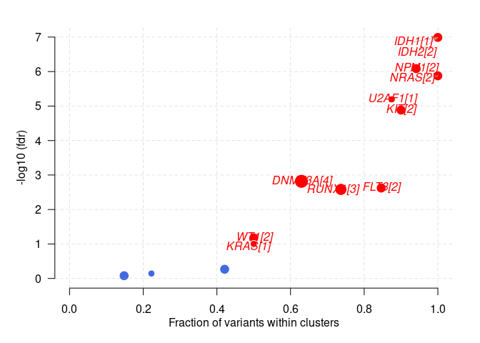<!-- -->

## Adding and summarizing pfam domains

maftools comes with the function pfamDomains, which adds pfam domain
information to the amino acid changes. pfamDomain also summarizes amino
acid changes according to the domains that are affected. This serves the
purpose of knowing what domain in given cancer cohort, is most
frequently
    affected.

``` r
laml.pfam = pfamDomains(maf = laml, AACol = 'Protein_Change', top = 10)
```

    ## Warning in pfamDomains(maf = laml, AACol = "Protein_Change", top = 10): Removed
    ## 50 mutations for which AA position was not available

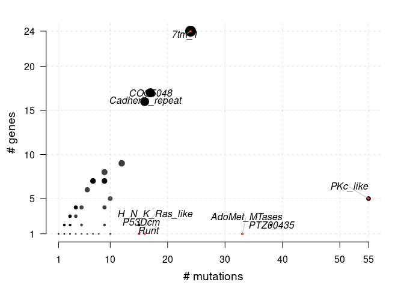<!-- -->

``` r
#Protein summary (Printing first 7 columns for display convenience)
laml.pfam$proteinSummary[,1:7, with = FALSE]
```

    ##         HGNC AAPos Variant_Classification  N total  fraction   DomainLabel
    ##    1: DNMT3A   882      Missense_Mutation 27    54 0.5000000 AdoMet_MTases
    ##    2:   IDH1   132      Missense_Mutation 18    18 1.0000000      PTZ00435
    ##    3:   IDH2   140      Missense_Mutation 17    20 0.8500000      PTZ00435
    ##    4:   FLT3   835      Missense_Mutation 14    52 0.2692308      PKc_like
    ##    5:   FLT3   599           In_Frame_Ins 10    52 0.1923077      PKc_like
    ##   ---                                                                     
    ## 1512: ZNF646   875      Missense_Mutation  1     1 1.0000000          <NA>
    ## 1513: ZNF687   554      Missense_Mutation  1     2 0.5000000          <NA>
    ## 1514: ZNF687   363      Missense_Mutation  1     2 0.5000000          <NA>
    ## 1515: ZNF75D     5      Missense_Mutation  1     1 1.0000000          <NA>
    ## 1516: ZNF827   427        Frame_Shift_Del  1     1 1.0000000          <NA>

``` r
#Domain summary (Printing first 3 columns for display convenience)
laml.pfam$domainSummary[,1:3, with = FALSE]
```

    ##        DomainLabel nMuts nGenes
    ##   1:      PKc_like    55      5
    ##   2:      PTZ00435    38      2
    ##   3: AdoMet_MTases    33      1
    ##   4:         7tm_1    24     24
    ##   5:       COG5048    17     17
    ##  ---                           
    ## 499:    ribokinase     1      1
    ## 500:   rim_protein     1      1
    ## 501: sigpep_I_bact     1      1
    ## 502:           trp     1      1
    ## 503:        zf-BED     1      1

## Pan-Cancer comparison

Lawrence et al performed MutSigCV analysis on 21 cancer cohorts and
identified over 200 genes to be significantly mutated which consists of
previously un-subscribed novel genes 9. Their results show only few
genes are mutated in multiple cohort while many of them are
tissue/cohort specific. We can compare mutSig results against this
pan-can list of significantly mutated genes to see genes specifically
mutated in given cohort. This function requires MutSigCV results
(usually named sig\_genes.txt) as an input.

``` r
#MutsigCV results for TCGA-AML
laml.mutsig <- system.file("extdata", "LAML_sig_genes.txt.gz", package = "maftools")
pancanComparison(mutsigResults = laml.mutsig, qval = 0.1, cohortName = 'LAML', inputSampleSize = 200, label = 1)
```

    ## Significantly mutated genes in LAML (q < 0.1): 23

    ## Significantly mutated genes in PanCan cohort (q <0.1): 114

    ## Significantly mutated genes exclusive to LAML (q < 0.1):

    ##       gene pancan            q nMut log_q_pancan     log_q
    ##  1:  CEBPA  1.000 3.500301e-12   13   0.00000000 11.455895
    ##  2:   EZH2  1.000 7.463546e-05    3   0.00000000  4.127055
    ##  3: GIGYF2  1.000 6.378338e-03    2   0.00000000  2.195292
    ##  4:    KIT  0.509 1.137517e-05    8   0.29328222  4.944042
    ##  5:   PHF6  0.783 6.457555e-09    6   0.10623824  8.189932
    ##  6: PTPN11  0.286 7.664584e-03    9   0.54363397  2.115511
    ##  7:  RAD21  0.929 1.137517e-05    5   0.03198429  4.944042
    ##  8:  SMC1A  0.801 2.961696e-03    6   0.09636748  2.528460
    ##  9:   TET2  0.907 2.281625e-13   17   0.04239271 12.641756
    ## 10:    WT1  1.000 2.281625e-13   12   0.00000000 12.641756

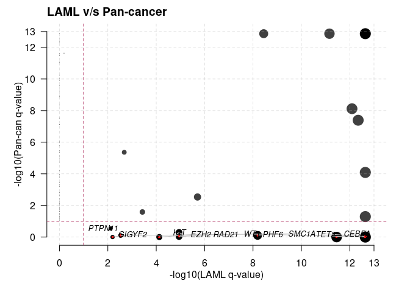<!-- -->

    ##          gene   pancan            q nMut log_q_pancan    log_q
    ##   1:   ACVR1B 6.11e-02 1.000000e+00    0     1.213959  0.00000
    ##   2:     AKT1 2.68e-10 1.000000e+00    0     9.571865  0.00000
    ##   3:      APC 1.36e-13 1.000000e+00    0    12.866461  0.00000
    ##   4:    APOL2 7.96e-03 1.000000e+00    0     2.099087  0.00000
    ##   5: ARHGAP35 2.32e-12 1.000000e+00    1    11.634512  0.00000
    ##  ---                                                          
    ## 120:    U2AF1 4.07e-08 4.503311e-13    8     7.390406 12.34647
    ## 121:      VHL 2.32e-12 1.000000e+00    0    11.634512  0.00000
    ## 122:      WT1 1.00e+00 2.281625e-13   12     0.000000 12.64176
    ## 123:   ZNF180 8.60e-02 1.000000e+00    0     1.065502  0.00000
    ## 124:   ZNF483 2.37e-02 1.000000e+00    0     1.625252  0.00000

## Survival analysis

Survival analysis is an essential part of cohort based sequencing
projects. Function mafSurvive performs survival analysis and draws
kaplan meier curve by grouping samples based on mutation status of user
defined gene(s) or manually provided samples those make up a group. This
function requires input data to contain Tumor\_Sample\_Barcode (make
sure they match to those in MAF file), binary event (1/0) and time to
event. \#\#\# Mutation in any given genes

``` r
#Survival analysis based on grouping of DNMT3A mutation status
mafSurvival(maf = laml, genes = 'DNMT3A', time = 'days_to_last_followup', Status = 'Overall_Survival_Status', isTCGA = TRUE)
```

    ## Looking for clinical data in annoatation slot of MAF..

    ## Number of mutated samples for given genes:

    ## DNMT3A 
    ##     48

    ## Removed 11 samples with NA's

    ## Median survival..

    ##     Group medianTime   N
    ## 1: Mutant        245  45
    ## 2:     WT        396 137

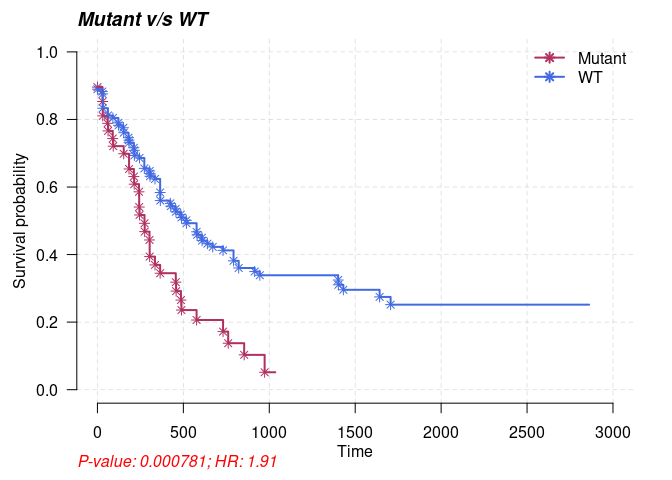<!-- -->
\#\#\# Predict genesets associated with survival Identify set of genes
which results in poor
survival

``` r
#Using top 20 mutated genes to identify a set of genes (of size 2) to predict poor prognostic groups
prog_geneset = survGroup(maf = laml, top = 20, geneSetSize = 2, time = "days_to_last_followup", Status = "Overall_Survival_Status", verbose = FALSE)
```

    ## Removed 11 samples with NA's

``` r
print(prog_geneset)
```

    ##     Gene_combination P_value    hr  WT Mutant
    ##  1:      FLT3_DNMT3A 0.00104 2.510 164     18
    ##  2:      DNMT3A_SMC3 0.04880 2.220 176      6
    ##  3:      DNMT3A_NPM1 0.07190 1.720 166     16
    ##  4:      DNMT3A_TET2 0.19600 1.780 176      6
    ##  5:        FLT3_TET2 0.20700 1.860 177      5
    ##  6:        NPM1_IDH1 0.21900 0.495 176      6
    ##  7:      DNMT3A_IDH1 0.29300 1.500 173      9
    ##  8:       IDH2_RUNX1 0.31800 1.580 176      6
    ##  9:        FLT3_NPM1 0.53600 1.210 165     17
    ## 10:      DNMT3A_IDH2 0.68000 0.747 178      4
    ## 11:      DNMT3A_NRAS 0.99200 0.986 178      4

Above results show a combination (N = 2) of genes which are associated
with poor survival (P \< 0.05). We can draw KM curve for above results
with the function
mafSurvGroup

``` r
mafSurvGroup(maf = laml, geneSet = c("DNMT3A", "FLT3"), time = "days_to_last_followup", Status = "Overall_Survival_Status")
```

    ## Looking for clinical data in annoatation slot of MAF..

    ## Removed 11 samples with NA's

    ## Median survival..

    ##     Group medianTime   N
    ## 1: Mutant      242.5  18
    ## 2:     WT      379.5 164

<!-- --> \#\#
Comparing two cohorts (MAFs) Cancers differ from each other in terms of
their mutation pattern. We can compare two different cohorts to detect
such differentially mutated genes. For example, recent article by Madan
et. al 9, have shown that patients with relapsed APL (Acute
Promyelocytic Leukemia) tends to have mutations in PML and RARA genes,
which were absent during primary stage of the disease. This difference
between two cohorts (in this case primary and relapse APL) can be
detected using function mafComapre, which performs fisher test on all
genes between two cohorts to detect differentially mutated genes.

``` r
#Primary APL MAF
primary.apl = system.file("extdata", "APL_primary.maf.gz", package = "maftools")
primary.apl = read.maf(maf = primary.apl)
```

    ## -Reading
    ## -Validating
    ## --Non MAF specific values in Variant_Classification column:
    ##   ITD
    ## -Silent variants: 45 
    ## -Summarizing
    ## -Processing clinical data
    ## --Missing clinical data
    ## -Finished in 0.632s elapsed (0.212s cpu)

``` r
#Relapse APL MAF
relapse.apl = system.file("extdata", "APL_relapse.maf.gz", package = "maftools")
relapse.apl = read.maf(maf = relapse.apl)
```

    ## -Reading
    ## -Validating
    ## --Non MAF specific values in Variant_Classification column:
    ##   ITD
    ## -Silent variants: 19 
    ## -Summarizing
    ## -Processing clinical data
    ## --Missing clinical data
    ## -Finished in 0.563s elapsed (0.234s cpu)

``` r
pt.vs.rt <- mafCompare(m1 = primary.apl, m2 = relapse.apl, m1Name = 'Primary', m2Name = 'Relapse', minMut = 5)
print(pt.vs.rt)
```

    ## $results
    ##    Hugo_Symbol Primary Relapse         pval         or       ci.up      ci.low
    ## 1:         PML       1      11 1.529935e-05 0.03537381   0.2552937 0.000806034
    ## 2:        RARA       0       7 2.574810e-04 0.00000000   0.3006159 0.000000000
    ## 3:       RUNX1       1       5 1.310500e-02 0.08740567   0.8076265 0.001813280
    ## 4:        FLT3      26       4 1.812779e-02 3.56086275  14.7701728 1.149009169
    ## 5:      ARID1B       5       8 2.758396e-02 0.26480490   0.9698686 0.064804160
    ## 6:         WT1      20      14 2.229087e-01 0.60619329   1.4223101 0.263440988
    ## 7:        KRAS       6       1 4.334067e-01 2.88486293 135.5393108 0.337679367
    ## 8:        NRAS      15       4 4.353567e-01 1.85209500   8.0373994 0.553883512
    ## 9:      ARID1A       7       4 7.457274e-01 0.80869223   3.9297309 0.195710173
    ##         adjPval
    ## 1: 0.0001376942
    ## 2: 0.0011586643
    ## 3: 0.0393149868
    ## 4: 0.0407875250
    ## 5: 0.0496511201
    ## 6: 0.3343630535
    ## 7: 0.4897762916
    ## 8: 0.4897762916
    ## 9: 0.7457273717
    ## 
    ## $SampleSummary
    ##     Cohort SampleSize
    ## 1: Primary        124
    ## 2: Relapse         58

### Forest plots

Above results show two genes PML and RARA which are highly mutated in
Relapse APL compared to Primary APL. We can visualize these results as a
forestplot.

``` r
forestPlot(mafCompareRes = pt.vs.rt, pVal = 0.1, color = c('royalblue', 'maroon'), geneFontSize = 0.8)
```


\#\#\# Co-onco plots Another alternative way of displaying above results
is by plotting two oncoplots side by side. coOncoplot function takes two
maf objects and plots them side by side for better comparison.

``` r
genes = c("PML", "RARA", "RUNX1", "ARID1B", "FLT3")
coOncoplot(m1 = primary.apl, m2 = relapse.apl, m1Name = 'PrimaryAPL', m2Name = 'RelapseAPL', genes = genes, removeNonMutated = TRUE)
```

<!-- -->
\#\#\# Lollipop plot-2 Along with plots showing cohort wise differences,
its also possible to show gene wise differences with lollipopPlot2
function.

``` r
lollipopPlot2(m1 = primary.apl, m2 = relapse.apl, gene = "PML", AACol1 = "amino_acid_change", AACol2 = "amino_acid_change", m1_name = "Primary", m2_name = "Relapse")
```

    ## Gene: PML

    ## 9 transcripts available. Use arguments refSeqID or proteinID to manually specify tx name.

    ##    HGNC refseq.ID protein.ID aa.length
    ## 1:  PML NM_033238  NP_150241       882
    ## 2:  PML NM_002675  NP_002666       633
    ## 3:  PML NM_033249  NP_150252       585
    ## 4:  PML NM_033247  NP_150250       435
    ## 5:  PML NM_033239  NP_150242       829
    ## 6:  PML NM_033250  NP_150253       781
    ## 7:  PML NM_033240  NP_150243       611
    ## 8:  PML NM_033244  NP_150247       560
    ## 9:  PML NM_033246  NP_150249       423

    ## Using longer transcript NM_033238 for now.
    ## 9 transcripts available. Use arguments refSeqID or proteinID to manually specify tx name.

    ##    HGNC refseq.ID protein.ID aa.length
    ## 1:  PML NM_033238  NP_150241       882
    ## 2:  PML NM_002675  NP_002666       633
    ## 3:  PML NM_033249  NP_150252       585
    ## 4:  PML NM_033247  NP_150250       435
    ## 5:  PML NM_033239  NP_150242       829
    ## 6:  PML NM_033250  NP_150253       781
    ## 7:  PML NM_033240  NP_150243       611
    ## 8:  PML NM_033244  NP_150247       560
    ## 9:  PML NM_033246  NP_150249       423

    ## Using longer transcript NM_033238 for now.

<!-- --> \#\#
Clinical enrichment analysis clinicalEnrichment is another function
which takes any clinical feature associated with the samples and
performs enrichment analysis. It performs various groupwise and pairwise
comparisions to identify enriched mutations for every category within a
clincila feature. Below is an example to identify mutations associated
with
FAB\_classification.

``` r
fab.ce = clinicalEnrichment(maf = laml, clinicalFeature = 'FAB_classification')
```

    ## Sample size per factor in FAB_classification:

    ## 
    ## M0 M1 M2 M3 M4 M5 M6 M7 
    ## 19 44 44 21 39 19  3  3

``` r
#Results are returned as a list. Significant associations p-value < 0.05
fab.ce$groupwise_comparision[p_value < 0.05]
```

    ##    Hugo_Symbol Group1 Group2 n_mutated_group1 n_mutated_group2      p_value
    ## 1:        IDH1     M1   Rest         11 of 44         7 of 149 0.0002597371
    ## 2:        TP53     M7   Rest           3 of 3        12 of 190 0.0003857187
    ## 3:      DNMT3A     M5   Rest         10 of 19        38 of 174 0.0057610493
    ## 4:       CEBPA     M2   Rest          7 of 44         6 of 149 0.0117352110
    ## 5:       RUNX1     M0   Rest          5 of 19        11 of 174 0.0117436825
    ## 6:        NPM1     M5   Rest          7 of 19        26 of 174 0.0248582372
    ## 7:       CEBPA     M1   Rest          6 of 44         7 of 149 0.0478737468
    ##    OR_low   OR_high       fdr
    ## 1:      0 0.3926994 0.0308575
    ## 2:      0 0.1315271 0.0308575
    ## 3:      0 0.6406007 0.3072560
    ## 4:      0 0.6874270 0.3757978
    ## 5:      0 0.6466787 0.3757978
    ## 6:      0 0.8342897 0.6628863
    ## 7:      0 0.9869971 1.0000000

There is also a small function - plotEnrichmentResults which can be used
to plot these results.

``` r
plotEnrichmentResults(enrich_res = fab.ce, pVal = 0.05)
```

<!-- --> \#\#
Drug-Gene Interactions drugInteractions function checks for drug–gene
interactions and gene druggability information compiled from Drug Gene
Interaction database.

``` r
dgi = drugInteractions(maf = laml, fontSize = 0.75)
```

<!-- -->
below is the results for known/reported drugs to interact with DNMT3A.

``` r
dnmt3a.dgi = drugInteractions(genes = "DNMT3A", drugs = TRUE)
```

    ## Number of claimed drugs for given genes:
    ##      Gene N
    ## 1: DNMT3A 7

``` r
#Printing selected columns.
dnmt3a.dgi[,.(Gene, interaction_types, drug_name, drug_claim_name)]
```

    ##      Gene interaction_types    drug_name drug_claim_name
    ## 1: DNMT3A                                            N/A
    ## 2: DNMT3A                   DAUNORUBICIN    Daunorubicin
    ## 3: DNMT3A                     DECITABINE      Decitabine
    ## 4: DNMT3A                     IDARUBICIN      IDARUBICIN
    ## 5: DNMT3A                     DECITABINE      DECITABINE
    ## 6: DNMT3A         inhibitor   DECITABINE   CHEMBL1201129
    ## 7: DNMT3A         inhibitor  AZACITIDINE      CHEMBL1489

## Oncogenic Signaling Pathways

OncogenicPathways function checks for enrichment of known Oncogenic
Signaling Pathways in TCGA cohorts 11

``` r
OncogenicPathways(maf = laml)
```

    ## Pathway alteration fractions

    ##        Pathway  N n_affected_genes fraction_affected
    ##  1:    RTK-RAS 85               18        0.21176471
    ##  2:      Hippo 38                7        0.18421053
    ##  3:      NOTCH 71                6        0.08450704
    ##  4:        MYC 13                3        0.23076923
    ##  5:        WNT 68                3        0.04411765
    ##  6:       TP53  6                2        0.33333333
    ##  7:       NRF2  3                1        0.33333333
    ##  8:       PI3K 29                1        0.03448276
    ##  9: Cell_Cycle 15                0        0.00000000
    ## 10:   TGF-Beta  7                0        0.00000000

<!-- --> Its
also possible to visualize complete pathway.

``` r
PlotOncogenicPathways(maf = laml, pathways = "RTK-RAS")
```

<!-- -->

## Mutational Signatures

``` r
#Requires BSgenome object
library(BSgenome.Hsapiens.UCSC.hg19, quietly = TRUE)
```

    ## 
    ## Attaching package: 'BiocGenerics'

    ## The following objects are masked from 'package:parallel':
    ## 
    ##     clusterApply, clusterApplyLB, clusterCall, clusterEvalQ,
    ##     clusterExport, clusterMap, parApply, parCapply, parLapply,
    ##     parLapplyLB, parRapply, parSapply, parSapplyLB

    ## The following objects are masked from 'package:stats':
    ## 
    ##     IQR, mad, sd, var, xtabs

    ## The following objects are masked from 'package:base':
    ## 
    ##     anyDuplicated, append, as.data.frame, basename, cbind, colnames,
    ##     dirname, do.call, duplicated, eval, evalq, Filter, Find, get, grep,
    ##     grepl, intersect, is.unsorted, lapply, Map, mapply, match, mget,
    ##     order, paste, pmax, pmax.int, pmin, pmin.int, Position, rank,
    ##     rbind, Reduce, rownames, sapply, setdiff, sort, table, tapply,
    ##     union, unique, unsplit, which, which.max, which.min

    ## 
    ## Attaching package: 'S4Vectors'

    ## The following object is masked from 'package:base':
    ## 
    ##     expand.grid

    ## 
    ## Attaching package: 'Biostrings'

    ## The following object is masked from 'package:base':
    ## 
    ##     strsplit

``` r
laml.tnm = trinucleotideMatrix(maf = laml, prefix = 'chr', add = TRUE, ref_genome = "BSgenome.Hsapiens.UCSC.hg19")
```

    ## Warning in trinucleotideMatrix(maf = laml, prefix = "chr", add = TRUE, ref_genome = "BSgenome.Hsapiens.UCSC.hg19"): Chromosome names in MAF must match chromosome names in reference genome.
    ## Ignorinig 101 single nucleotide variants from missing chromosomes chr23

    ## -Extracting 5' and 3' adjacent bases
    ## -Extracting +/- 20bp around mutated bases for background C>T estimation
    ## -Estimating APOBEC enrichment scores
    ## --Performing one-way Fisher's test for APOBEC enrichment
    ## ---APOBEC related mutations are enriched in  3.315 % of samples (APOBEC enrichment score > 2 ;  6  of  181  samples)
    ## -Creating mutation matrix
    ## --matrix of dimension 188x96

### Differences between APOBEC enriched and non-enriched samples

plotApobecDiff is a function which takes APOBEC enrichment scores
estimated by trinucleotideMatrix and classifies samples into APOBEC
enriched and non-APOBEC enriched. Once stratified, it compares these two
groups to identify differentially altered genes.

``` r
plotApobecDiff(tnm = laml.tnm, maf = laml, pVal = 0.2)
```

<!-- -->

    ## $results
    ##      Hugo_Symbol Enriched nonEnriched       pval        or      ci.up
    ##   1:        TP53        2          13 0.08175632 5.9976455  46.608861
    ##   2:        TET2        1          16 0.45739351 1.9407002  18.983979
    ##   3:        FLT3        2          45 0.65523131 1.4081851  10.211621
    ##   4:      DNMT3A        1          47 1.00000000 0.5335362   4.949499
    ##   5:      ADAM11        0           2 1.00000000 0.0000000 164.191472
    ##  ---                                                                 
    ## 132:         WAC        0           2 1.00000000 0.0000000 164.191472
    ## 133:         WT1        0          12 1.00000000 0.0000000  12.690862
    ## 134:      ZBTB33        0           2 1.00000000 0.0000000 164.191472
    ## 135:      ZC3H18        0           2 1.00000000 0.0000000 164.191472
    ## 136:      ZNF687        0           2 1.00000000 0.0000000 164.191472
    ##          ci.low adjPval
    ##   1: 0.49875432       1
    ##   2: 0.03882963       1
    ##   3: 0.12341748       1
    ##   4: 0.01101929       1
    ##   5: 0.00000000       1
    ##  ---                   
    ## 132: 0.00000000       1
    ## 133: 0.00000000       1
    ## 134: 0.00000000       1
    ## 135: 0.00000000       1
    ## 136: 0.00000000       1
    ## 
    ## $SampleSummary
    ##         Cohort SampleSize  Mean Median
    ## 1:    Enriched          6 7.167    6.5
    ## 2: nonEnriched        172 9.715    9.0

### Signature analysis

Signature analysis includes following steps.

``` r
library('NMF')
```

    ## Loading required package: pkgmaker

    ## Loading required package: registry

    ## 
    ## Attaching package: 'pkgmaker'

    ## The following object is masked from 'package:S4Vectors':
    ## 
    ##     new2

    ## Loading required package: rngtools

    ## Loading required package: cluster

    ## NMF - BioConductor layer [OK] | Shared memory capabilities [NO: bigmemory] | Cores 3/4

    ##   To enable shared memory capabilities, try: install.extras('
    ## NMF
    ## ')

    ## 
    ## Attaching package: 'NMF'

    ## The following object is masked from 'package:S4Vectors':
    ## 
    ##     nrun

``` r
laml.sign = estimateSignatures(mat = laml.tnm, nTry = 6, pConstant = 1)
```

    ## -Running NMF for 6 ranks
    ## Compute NMF rank= 2  ... + measures ... OK
    ## Compute NMF rank= 3  ... + measures ... OK
    ## Compute NMF rank= 4  ... + measures ... OK
    ## Compute NMF rank= 5  ... + measures ... OK
    ## Compute NMF rank= 6  ... + measures ... OK

<!-- -->

    ## -Finished in 00:09:29 elapsed (25.4s cpu)

Draw elbow plot to visualize and decide optimal number of signatures
from above results.

``` r
plotCophenetic(res = laml.sign)
```

<!-- -->

    ## -Running NMF for factorization rank: 3

    ## -Finished in12.8s elapsed (4.079s cpu)

``` r
#Compate against original 30 signatures 
laml.og30.cosm = compareSignatures(nmfRes = laml.sig, sig_db = "legacy")
```

    ## -Comparing against COSMIC signatures

    ## ------------------------------------

    ## --Found Signature_1 most similar to COSMIC_1

    ##    Aetiology: spontaneous deamination of 5-methylcytosine [cosine-similarity: 0.84]

    ## --Found Signature_2 most similar to COSMIC_1

    ##    Aetiology: spontaneous deamination of 5-methylcytosine [cosine-similarity: 0.577]

    ## --Found Signature_3 most similar to COSMIC_5

    ##    Aetiology: Unknown [cosine-similarity: 0.851]

    ## ------------------------------------

``` r
#Compate against updated version3 60 signatures 
laml.v3.cosm = compareSignatures(nmfRes = laml.sig, sig_db = "SBS")
```

    ## -Comparing against COSMIC signatures

    ## ------------------------------------

    ## --Found Signature_1 most similar to SBS1

    ##    Aetiology: spontaneous or enzymatic deamination of 5-methylcytosine [cosine-similarity: 0.858]

    ## --Found Signature_2 most similar to SBS6

    ##    Aetiology: defective DNA mismatch repair [cosine-similarity: 0.538]

    ## --Found Signature_3 most similar to SBS3

    ##    Aetiology: Defects in DNA-DSB repair by HR [cosine-similarity: 0.836]

    ## ------------------------------------

``` r
library('pheatmap')
pheatmap::pheatmap(mat = laml.og30.cosm$cosine_similarities, cluster_rows = FALSE, main = "cosine similarity against validated signatures")
```

<!-- -->
Finally plot signatures

``` r
maftools::plotSignatures(nmfRes = laml.sig, title_size = 0.8)
```

<!-- -->
\#\#\# Signature enrichment analysis Signatures can further be assigned
to samples and enrichment analysis can be performd using
signatureEnrichment funtion, which identifies mutations enriched in
every signature identified.

``` r
laml.se = signatureEnrichment(maf = laml, sig_res = laml.sig)
```

    ## Running k-means for signature assignment..

    ## Performing pairwise and groupwise comparisions..

    ## Sample size per factor in Signature:

    ## 
    ## Signature_1 Signature_2 Signature_3 
    ##          60          65          63

    ## Estimating mutation load and signature exposures..

<!-- -->

``` r
plotEnrichmentResults(enrich_res = laml.se, pVal = 0.05)
```

<!-- -->
